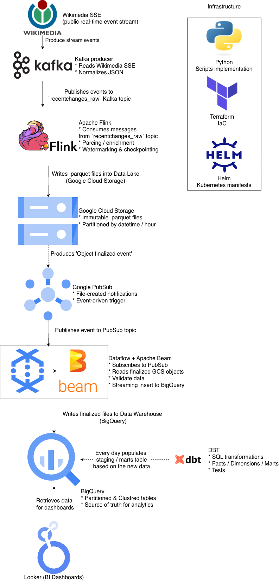
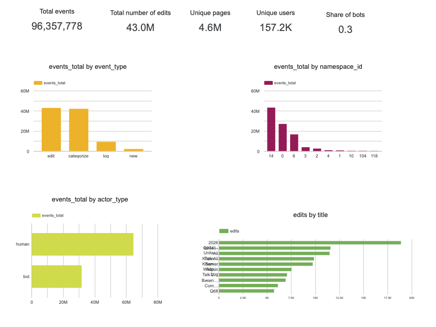
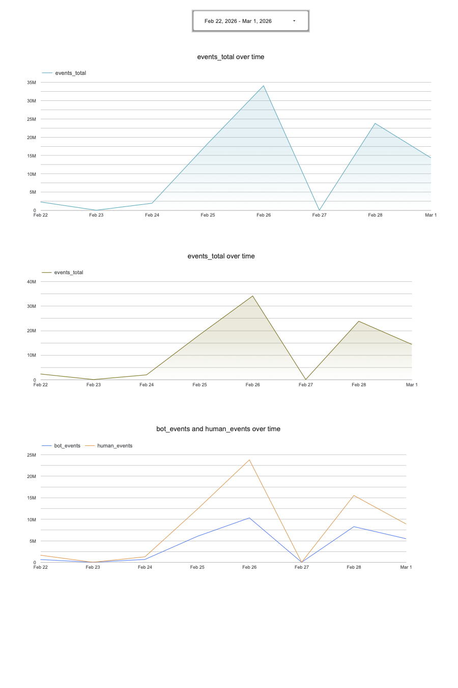
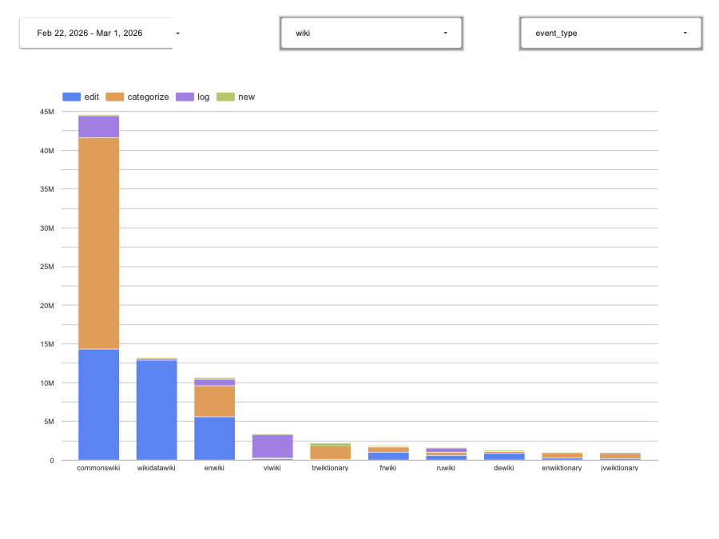

# Wikimedia Stream Analytics

[](https://github.com/vsokoltsov/wiki-stream-analytics/actions/workflows/dbt.yml)
[](https://github.com/vsokoltsov/wiki-stream-analytics/actions/workflows/processing.yml)
[](https://github.com/vsokoltsov/wiki-stream-analytics/actions/workflows/ingestion.yml)
[](https://github.com/vsokoltsov/wiki-stream-analytics/actions/workflows/producer.yml)
[](https://github.com/vsokoltsov/wiki-stream-analytics/actions/workflows/k8s.yml)
[](https://github.com/vsokoltsov/wiki-stream-analytics/actions/workflows/terraform.yml)


## 🎯 Objective

The objective of this project is to design and implement a production-grade, cloud-native real-time data streaming platform that ingests Wikimedia’s public event stream, processes it using distributed stream processing frameworks, and delivers reliable, structured, and analytics-ready datasets to a cloud data warehouse.

The system is built to:
* Ingest high-velocity, unbounded event streams in real time
* Validate, normalize, and enrich semi-structured JSON payloads
* Ensure fault tolerance and processing guarantees (exactly-once semantics, checkpointing, state management)
* Support horizontal scalability under varying traffic conditions
* Enable reproducible deployments via Infrastructure as Code (Terraform, Helm)
* Implement CI/CD pipelines for automated testing and containerized deployment
* Provide a foundation for downstream analytics, BI workloads, and ML feature engineering

The overarching goal is to demonstrate how modern streaming technologies can be combined into a cohesive, scalable, and maintainable data platform aligned with real-world production standards.

## 🧩 Problem Statement

Public real-time event streams (such as Wikimedia’s RecentChange feed) generate high-velocity, semi-structured JSON events that:
* arrive continuously,
* may contain inconsistent fields,
* require validation and normalization,
* must be processed with low latency,
* and need reliable storage for downstream analytics.

The challenge is to design a scalable, cloud-native streaming architecture that:
1. Ingests unbounded event streams reliably
2. Handles schema evolution and malformed records
3. Guarantees processing correctness (at-least-once / exactly-once)
4. Scales horizontally under variable load
5. Integrates with modern data stack components (Kafka/Flink/Beam/BigQuery/dbt)
6. Supports CI/CD and reproducible deployments

Without such architecture, raw streaming data:
* cannot be trusted for analytics,
* is difficult to monitor,
* may lead to data loss or duplication,
* and cannot be reliably used for ML feature pipelines.

## ⚙️ Data Pipeline

Chosen Approach: Streaming

For this project and dataset, a streaming architecture was selected.

The Wikimedia RecentChange feed produces a continuous, unbounded stream of events. Since edits occur in real time and at high frequency, a streaming pipeline allows:
* Immediate ingestion of events from the SSE endpoint
* Low-latency processing via Apache Flink
* Incremental writes to Google Cloud Storage
* Event-driven downstream processing using Pub/Sub and Dataflow
* Near real-time availability of structured data in BigQuery

This approach better reflects modern production-grade data platforms where real-time ingestion, event-driven processing, and scalable stream computation are required.

## Diagram




## Structure

```
wiki-stream-analytics
  ├── .dockerignore                                  <- Root Docker ignore rules for image builds
  ├── .env.sample                                    <- Example local environment variables
  ├── .gitattributes                                 <- Git attribute configuration
  ├── .github                                        <- GitHub-specific automation config
  │   └── workflows                                  <- CI/CD pipelines
  │       ├── dbt-refresh.yaml                       <- Scheduled dbt refresh workflow
  │       ├── dbt.yml                                <- dbt validation workflow
  │       ├── ingestion.yml                          <- CI/CD for the ingestion module
  │       ├── k8s.yml                                <- Helm/Kubernetes config verification workflow
  │       ├── processing.yml                         <- CI/CD for the Flink processing module
  │       ├── producer.yml                           <- CI/CD for the producer module
  │       └── terraform.yml                          <- Terraform verification workflow
  ├── .gitignore                                     <- Repository ignore rules
  ├── .python-version                                <- Preferred Python version for local tooling
  ├── Makefile                                       <- Common developer commands
  ├── README.md                                      <- Top-level project overview and deployment notes
  ├── dbt                                            <- Analytics transformation project
  │   ├── README.md                                  <- dbt-specific documentation
  │   ├── pyproject.toml                             <- dbt Python dependencies and tooling config
  │   ├── uv.lock                                    <- Locked dbt dependency versions
  │   └── wikistream_analytics                       <- Main dbt project
  │       ├── README.md                              <- dbt project documentation
  │       ├── analyses                               <- Optional ad hoc SQL analysis area
  │       ├── dbt_project.yml                        <- dbt project configuration
  │       ├── macros                                 <- Custom dbt macros
  │       ├── models                                 <- Staging and mart models
  │       │   ├── marts                              <- Final analytics-facing models
  │       │   ├── sources.yml                        <- Source definitions and metadata
  │       │   └── staging                            <- Staging-layer transformations
  │       ├── packages.yml                           <- Declared dbt packages
  │       ├── package-lock.yml                       <- Locked dbt package versions
  │       ├── seeds                                  <- Static seed datasets
  │       ├── snapshots                              <- Snapshot definitions
  │       └── tests                                  <- dbt test definitions
  ├── docker-compose.yaml                            <- Local multi-service development stack
  ├── docs                                           <- Documentation assets and screenshots
  │   ├── cover.png                                  <- Cover image for project docs/presentation
  │   ├── dashboard_breakdown.png                    <- Dashboard screenshot
  │   ├── dashboard_general.png                      <- Dashboard screenshot
  │   ├── dashboard_timeframe.png                    <- Dashboard screenshot
  │   └── diagram_brief.png                          <- High-level architecture diagram
  ├── infra                                          <- Infrastructure code
  │   ├── k8s                                        <- Helm charts for Kubernetes workloads
  │   │   ├── README.md                              <- Kubernetes chart structure and usage guide
  │   │   └── charts                                 <- Helm charts
  │   │       ├── common                             <- Shared Helm helper/library chart
  │   │       ├── edge-access                        <- Public service exposure chart
  │   │       ├── wiki-processing                    <- Flink processing deployment chart
  │   │       └── wiki-producer                      <- Producer deployment chart
  │   └── terraform                                  <- Terraform root and reusable modules
  │       ├── README.md                              <- Terraform stack documentation
  │       ├── GITHUB_ACTIONS.md                      <- Terraform CI bootstrap notes
  │       ├── analytics.tf                           <- Root wiring for analytics module
  │       ├── backend.tf                             <- Remote state backend declaration
  │       ├── bootstrap.tf                           <- Root wiring for bootstrap module
  │       ├── ci_cd.tf                               <- Root wiring for CI/CD module
  │       ├── data_lake.tf                           <- Root wiring for data lake module
  │       ├── gke.tf                                 <- Root wiring for GKE cluster module
  │       ├── gke_addons.tf                          <- Root wiring for post-cluster add-ons
  │       ├── network.tf                             <- Root wiring for network module
  │       ├── outputs.tf                             <- Root stack outputs
  │       ├── providers.tf                           <- Terraform provider configuration
  │       ├── streaming.tf                           <- Root wiring for streaming module
  │       ├── variables.tf                           <- Root input variables
  │       ├── terraform.tfvars.sample                <- Example Terraform variable values
  │       ├── .terraform.lock.hcl                    <- Locked provider versions
  │       ├── modules                                <- Business-oriented Terraform modules
  │       │   ├── analytics                          <- BigQuery/Dataflow analytics infrastructure
  │       │   ├── bootstrap                          <- Project API/service enablement
  │       │   ├── ci_cd                              <- Artifact Registry, WIF, CI identities, CI IAM
  │       │   ├── data_lake                          <- GCS/PubSub/raw landing zone resources
  │       │   ├── gke                                <- Core GKE cluster infrastructure
  │       │   ├── gke_addons                         <- Namespaces, operators, access add-ons
  │       │   ├── network                            <- VPC/subnet/router/NAT resources
  │       │   └── streaming                          <- Managed Kafka, runtime identities, secrets
  │       └── tests                                  <- Native Terraform tests
  ├── ingestion                                      <- Beam/Dataflow ingestion pipeline
  │   ├── Dockerfile.dataflow                        <- Container image for Dataflow runtime
  │   ├── Dockerfile.local                           <- Local ingestion container image
  │   ├── __init__.py                                <- Package marker
  │   ├── app.py                                     <- Local ingestion entrypoint
  │   ├── cloudbuild.yaml                            <- Cloud Build config for ingestion image
  │   ├── dataflow                                   <- Dataflow template metadata
  │   │   └── metadata.json                          <- Flex template metadata
  │   ├── dataflow.py                                <- Dataflow launcher entrypoint
  │   ├── pipeline                                   <- Beam pipeline implementation
  │   │   ├── deduplicate.py                         <- Deduplication transforms
  │   │   ├── definition.py                          <- Pipeline assembly
  │   │   ├── load.py                                <- BigQuery/load logic
  │   │   ├── map_fns.py                             <- Beam mapping helpers
  │   │   ├── parse.py                               <- Event parsing logic
  │   │   ├── routing.py                             <- Event routing logic
  │   │   └── stability.py                           <- File/object readiness and stability logic
  │   ├── settings.py                                <- Ingestion runtime settings
  │   └── tests                                      <- Unit and integration tests for ingestion
  ├── processing                                     <- Flink stream-processing application
  │   ├── Dockerfile                                 <- Processing runtime image
  │   ├── __init__.py                                <- Package marker
  │   ├── app.py                                     <- Flink job entrypoint and stream setup
  │   ├── cloudbuild.yaml                            <- Cloud Build config for processing image
  │   ├── jars                                       <- Flink/Kafka/GCS connector dependencies
  │   │   ├── flink-connector-kafka-4.0.1-2.0.jar    <- Kafka connector
  │   │   ├── flink-gs-fs-hadoop-2.0.1.jar           <- GCS filesystem plugin
  │   │   ├── flink-sql-parquet-2.0.1.jar            <- Parquet support
  │   │   ├── hadoop-auth-3.3.6.jar                  <- Hadoop dependency for GCS support
  │   │   ├── hadoop-client-api-3.3.6.jar            <- Hadoop dependency for GCS support
  │   │   ├── hadoop-client-runtime-3.3.6.jar        <- Hadoop dependency for GCS support
  │   │   ├── hadoop-common-3.3.6.jar                <- Hadoop dependency for GCS support
  │   │   ├── kafka-clients-3.9.1.jar                <- Kafka client library
  │   │   ├── managed-kafka-auth-login-handler-1.0.6.jar <- GCP Kafka auth helper
  │   │   └── pom.xml                                <- Maven descriptor for extra Java deps
  │   ├── pipeline.py                                <- Flink sink/table pipeline definition
  │   ├── settings.py                                <- Processing runtime settings
  │   └── tests                                      <- Unit tests for processing logic
  ├── producer                                       <- Wikimedia event producer application
  │   ├── .dockerignore                              <- Producer image ignore rules
  │   ├── Dockerfile                                 <- Producer runtime image
  │   ├── __init__.py                                <- Package marker
  │   ├── app.py                                     <- Producer process entrypoint
  │   ├── cloudbuild.yaml                            <- Cloud Build config for producer image
  │   ├── errors.py                                  <- Producer-specific exceptions
  │   ├── kafka.py                                   <- Kafka producer construction/helpers
  │   ├── protocols.py                               <- Internal protocol/type definitions
  │   ├── service.py                                 <- Producer service orchestration
  │   ├── settings.py                                <- Producer runtime settings
  │   ├── tests                                      <- Unit and integration tests for producer
  │   │   ├── sse_stub_server.py                     <- Local SSE stub for integration tests
  │   │   ├── test_service.py                        <- Producer service unit tests
  │   │   ├── test_service_integration.py            <- Producer service integration tests
  │   │   └── test_wiki_client.py                    <- Wikimedia client tests
  │   ├── token_provider.py                          <- Auth token support for Kafka/GCP auth
  │   └── wiki_client.py                             <- Wikimedia SSE client
  ├── pyproject.toml                                 <- Root Python project and dependency configuration
  ├── scripts                                        <- Operational helper scripts
  │   ├── bootstrap_terraform_ci_iam.sh              <- Bootstrap IAM for Terraform CI account
  │   ├── dataflow-deploy.sh                         <- Helper script for Dataflow deployment
  │   └── deploy_edge_access.sh                      <- Helper script for edge-access deployment
  ├── setup.py                                       <- Python packaging entrypoint
  └── uv.lock                                        <- Root locked Python dependency versions
  ```

## Data Warehouse

Data Warehouse Optimization

BigQuery is used as the analytical data warehouse.
Tables are explicitly partitioned and clustered based on expected upstream query patterns and data characteristics.

⸻

### 1️⃣ Raw Layer (wikistream_raw.recentchanges)

#### Partitioning

The raw ingestion table is provisioned via Terraform and optimized as follows:

```terraform
time_partitioning {
  type  = "DAY"
  field = "event_ts"
}

require_partition_filter = true
```

##### Why partition by event_ts (DAY)?

* The dataset is a continuous, unbounded event stream.
* Most analytical queries filter by time window (e.g., last 7 days, last 30 days).
* Partitioning by event timestamp ensures:
* Reduced data scanned
* Lower query cost
* Improved performance
* require_partition_filter = true prevents accidental full-table scans.

This is the natural partitioning strategy for streaming event data.

#### Clustering

```
clustering = ["wiki", "namespace_id"]
```

##### Why cluster by wiki and namespace_id?

Typical upstream queries:
* Filter by specific wiki (enwiki, dewiki, etc.)
* Analyze edits per namespace
* Aggregate events by wiki + namespace
* Group by wiki

Clustering on these fields:
* Physically co-locates related rows within partitions
* Reduces scanned blocks when filtering by wiki or namespace
* Improves performance of grouped aggregations

These fields have:
* Moderate cardinality
* High analytical relevance
* Frequent usage in WHERE / GROUP BY clauses

### 2️⃣ Staging Layer (stg_recentchange)

The staging table is built via dbt and further optimized:

```
{{ 
  config(
    materialized = 'table',
    partition_by = {
      "field": "event_date",
      "data_type": "date"
    },
    cluster_by = ["wiki", "event_type", "namespace_id"]
  ) 
}}
```

#### Partitioning by event_date
* Derived from event_ts
* Keeps time-based filtering efficient
* Aligns with common reporting dimensions (daily metrics)

Staging queries frequently apply rolling window filters (e.g., last 30 days), so date partitioning significantly reduces scan size.

#### Clustering by wiki, event_type, namespace_id

These fields are used in:
* Aggregations
* Filtering
* Mart calculations
* BI-style grouping

Example aggregation:

```
group by wiki, event_type, event_date
```

Clustering improves performance for:
* `WHERE wiki = 'enwiki'`
* `WHERE event_type = 'edit'`
* Namespace-level analytics
* Multi-dimensional aggregations

This ensures physical data layout matches analytical access patterns.

### 3️⃣ Mart Layer (Views)

Mart models are implemented as views over the staging table.

Rationale
* The staging table is already partitioned and clustered.
* Views reuse optimized underlying storage.
* No data duplication.
* Keeps transformations lightweight.

If usage patterns evolve (e.g., BI dashboards with heavy repeated queries), marts can be materialized as partitioned & clustered tables.

## Local setup

You can run parts of the stack locally with `docker compose`, but this project is not fully local-first.
Core cloud resources must still exist in GCP before local apps can work end-to-end, especially:
* Google Cloud Storage (GCS) buckets
* BigQuery datasets/tables
* Pub/Sub topics/subscriptions

Short local run flow:
1. Provision infrastructure in GCP first (at minimum via `terraform -chdir=infra/terraform apply`).
2. Authenticate locally with GCP credentials (`gcloud auth application-default login`), or export a service account key path via `GOOGLE_APPLICATION_CREDENTIALS`.
3. Create local env file from template (`cp .env.sample .env`) and set required values (project, region, bucket/topic/table names, etc.).
4. Start local services with `docker compose up --build`.

Use this mode for development and validation; production-like execution still depends on provisioned GCP infrastructure.

## Testing

Python tests are executed with `pytest` through `uv`. The same command pattern is used in the GitHub Actions workflows for `producer`, `processing`, and `ingestion`: install the relevant dependency groups with `uv sync`, then run the test subset with a pytest marker.

### Prepare the environment

Install the dependencies for the app you want to test together with the shared developer tooling:

```bash
uv sync --group producer --group dev --frozen
uv sync --group processing --group dev --frozen
uv sync --group ingestion --group dev --frozen
```

### Run tests locally

The following examples mirror the commands from `.github/workflows/producer.yml`, `.github/workflows/processing.yml`, and `.github/workflows/ingestion.yml`:

```bash
uv run pytest ./producer/tests/ -m unit -q
uv run pytest ./producer/tests/ -m integration -q

uv run pytest ./processing/tests/ -m unit -q
uv run pytest ./processing/tests/ -m integration -q

uv run pytest ./ingestion/tests/ -m unit -q
uv run pytest ./ingestion/tests/ -m integration -q
```

If you want to run the full test suite for one app without filtering by marker, you can drop the `-m ...` flag, for example:

```bash
uv run pytest ./producer/tests/ -q
```

## Scripts

The `scripts/` directory contains operational helpers for recurring infrastructure and deployment tasks:

* `scripts/bootstrap_terraform_ci_iam.sh` grants the Terraform CI service account the project-level IAM roles required by the GitHub Actions workflows, such as read access to IAM, Pub/Sub, Secret Manager, Managed Kafka, and admin access to storage.
* `scripts/dataflow-deploy.sh` builds the ingestion image with Cloud Build and then starts a Dataflow Flex Template job using the configured project, buckets, subscription, BigQuery table, and container image settings.
* `scripts/deploy_edge_access.sh` reads the Flink public IP from Terraform outputs and deploys or updates the `edge-access` Helm chart so the external load balancer points at that IP.

## Deployment

### Prerequisites

* [Terraform](https://www.hashicorp.com/en/products/terraform)
* [Helm](https://helm.sh/docs/intro/quickstart/)
* [GCloud CLI SDK](https://docs.cloud.google.com/sdk/docs/install-sdk)

### Steps

#### Infrastructure

> ⚠️ Note: fopr more detailed explanation, it is recommended to follow the guides from the specific infrastructure modules:
> * [Terraform](./infra/terraform/README.md)
> * [Helm](./infra/k8s/README.md)

1. Populate infra/terraform/terraform.tfvars from template `cp infra/terraform/terraform.tfvars.sample infra/terraform/terraform.tfvars` and fill the necessary data
2. Copy GCP service account file to the root folder
3. Run `gcloud auth application-default login` and authenticate
4. `terraform -chdir=infra/terraform plan`
5. `terraform -chdir=infra/terraform apply`

#### Applications

Each example of commands for apps' deployments is located in the Github Actions pipeline for each of the app:
* [producer](./github/workflows/producer.yml)
* [processing](./github/workflows/processing.yml)
* [ingestion](./github/workflows/ingestion.yml)

I strongly recommend to configure proper CI / CD
Necessary environment variables are:

* Secrets:
  * `AP_REPO`
  * `CI_SA_EMAIL`
  * `DATAFLOW_WORKER_SA`
  * `GCP_PROJECT_ID`
  * `GKE_CLUSTER`
  * `HELM_NAMESPACE`
  * `KAFKA_SASL_USERNAME`
  * `PROFILES_YAML`
  * `REGION`
  * `STAGING_BUCKET`
  * `WIF_PROVIDER`
* Envs:
  * `BIGQUERY_TABLE_ID`
  * `PUBSUB_SUBSCRIPTION`
  * `STAGING_LOCATION`
  * `TEMPLATE_GCS`
  * `TEMP_LOCATION`
  
## Dashboard

* [Looker](https://lookerstudio.google.com/reporting/3808acbe-89ec-47d7-a416-5e74c20fa432)






